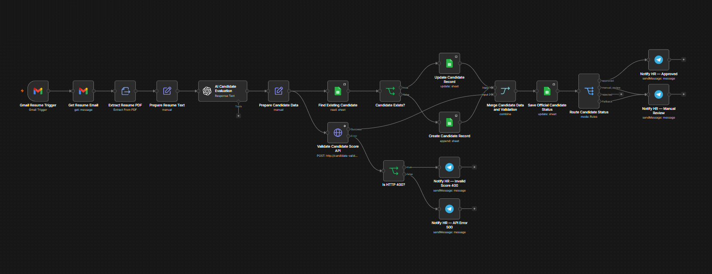

# AI Resume Screening Engine

[English version](README.md)

Система первичного отбора резюме, построенная в n8n. Workflow получает PDF-резюме из Gmail, оценивает кандидатов с помощью AI, сохраняет результаты в Google Sheets, получает официальный статус через детерминированный API и уведомляет HR в Telegram.

---

## Бизнес-задача

Ручная проверка резюме занимает много времени, плохо масштабируется и может приводить к непоследовательным решениям.

Workflow автоматизирует первичную оценку кандидатов. При этом правила присвоения статуса остаются детерминированными, а окончательное решение о найме принимает человек.

---

## Архитектура Workflow

```text
Gmail → Извлечение PDF → AI-анализ → Подготовка данных
                                     ├→ Поиск по email
                                     │    ├→ Обновить кандидата
                                     │    └→ Создать кандидата
                                     │             ↓
                                     │     pending_validation
                                     │             ↓
                                     │         Merge Input 1
                                     │
                                     └→ Validation API
                                          ├→ Успех → Merge Input 2
                                          └→ Ошибка → Уведомить HR

Merge → Сохранить официальный статус → Маршрутизация
                                       ├→ approved → Уведомить HR
                                       ├→ manual_review → Уведомить HR
                                       └→ rejected → Завершить
```

---

## Workflow



---

## Как это работает

1. Gmail получает письмо с резюме в формате PDF.
2. n8n извлекает текст из PDF.
3. OpenAI анализирует опыт, навыки, сильные стороны и недостающие требования, после чего выставляет оценку от 0 до 100.
4. Строгая JSON Schema обеспечивает предсказуемую структуру результата.
5. Google Sheets ищет кандидата по email и создаёт новую строку либо обновляет существующую.
6. Сначала кандидат сохраняется со статусом `pending_validation`.
7. Внешний API преобразует AI-оценку в официальный статус.
8. Этот статус записывается в строку того же кандидата.
9. HR получает соответствующее уведомление в Telegram.

---

## Правила Validation API

| Оценка | Официальный статус |
| ------ | ------------------ |
| 0–49   | `rejected`         |
| 50–89  | `manual_review`    |
| 90–100 | `approved`         |

При некорректной оценке API возвращает HTTP `400`. Другие ошибки API направляются в отдельную ветку технических уведомлений.

Репозиторий Validation API:

[candidate-validation-api](https://github.com/AlexZaytsev-ai/candidate-validation-api)

---

## Ключевые архитектурные решения

* AI анализирует резюме и предлагает оценку, но не назначает официальный статус.
* Validation API является источником истины для статуса кандидата.
* Email кандидата используется как бизнес-ключ для защиты от дубликатов.
* Данные кандидата сохраняются независимо от ответа API.
* До успешной валидации используется статус `pending_validation`.
* При ошибке API HR получает уведомление для ручной обработки.
* Окончательное решение о найме остаётся за человеком.

---

## Технологический стек

| Технология            | Назначение                          |
| --------------------- | ----------------------------------- |
| n8n                   | Автоматизация workflow              |
| Gmail API             | Получение резюме                    |
| OpenAI API            | Анализ и оценка кандидатов          |
| JSON Schema           | Строгий структурированный результат |
| Google Sheets API     | Реестр кандидатов                   |
| Node.js / Express API | Детерминированная валидация статуса |
| Telegram Bot API      | Уведомления HR                      |

---

## Импорт и настройка

Публичный экспорт не содержит credentials, идентификатор Google Sheets, Telegram chat ID и приватный URL API.

1. Импортируйте `ai-resume-screening-workflow.json` в n8n.
2. Настройте credentials для Gmail, OpenAI, Google Sheets и Telegram.
3. Выберите таблицу кандидатов во всех Google Sheets нодах.
4. Замените `YOUR_VALIDATION_API_URL` на адрес API, доступный из n8n.
5. Замените placeholders Telegram chat ID.
6. Проверьте сценарии нового кандидата, существующего кандидата и ошибок API.
7. После успешного тестирования активируйте workflow.

---

## Проверенные сценарии

* Новый кандидат создаётся с числовой оценкой.
* Существующий кандидат обновляется без создания дубликата.
* Временный статус `pending_validation` заменяется официальным статусом API.
* Оценка `2` приводит к статусу `rejected`.
* Данные кандидата сохраняются даже при ошибке API.
* HTTP `400` и другие ошибки API обрабатываются разными ветками уведомлений.

---

## Автор

Alexander Zaytsev

AI Automation Engineer

* GitHub: https://github.com/AlexZaytsev-ai
* Email: [polonix315@gmail.com](mailto:polonix315@gmail.com)
