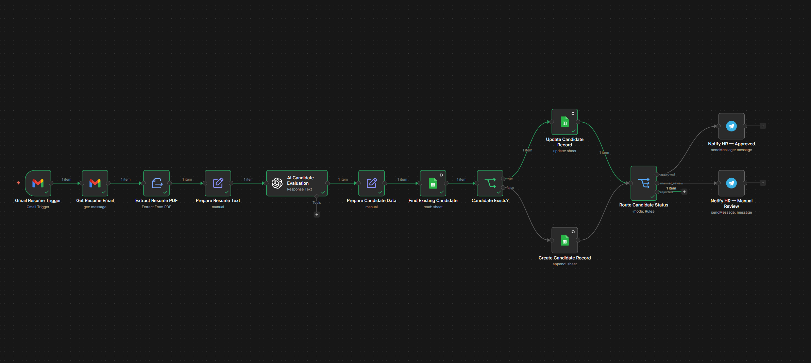

# AI Resume Screening Engine

AI-система для автоматической первичной оценки резюме, разработанная на **n8n**. Workflow получает резюме из Gmail, извлекает текст из PDF, анализирует кандидатов с помощью AI, сохраняет результаты в Google Sheets и уведомляет HR о подходящих кандидатах.

---

# Бизнес-проблема

HR-специалисты тратят значительное количество времени на ручной просмотр резюме, сравнение кандидатов с требованиями вакансии, выявление недостающих навыков и принятие решения о переходе кандидата на следующий этап.

Такой процесс повторяется ежедневно, занимает много времени и становится особенно сложным при большом количестве откликов.

Цель проекта — автоматизировать первичный этап оценки кандидатов, оставив окончательное решение за HR-специалистом.

---

# Решение

Workflow автоматически:

- получает письма с резюме из Gmail;
- скачивает PDF-вложения;
- извлекает текст из документа;
- анализирует кандидата с помощью AI;
- структурирует результаты;
- проверяет, существует ли кандидат в базе;
- создаёт новую запись или обновляет существующую;
- уведомляет HR о подходящих кандидатах.

---

# Архитектура Workflow



---

# Workflow

```text
Gmail Resume Trigger
        │
        ▼
Получение письма
        │
        ▼
Извлечение PDF
        │
        ▼
Подготовка текста
        │
        ▼
AI-анализ кандидата
        │
        ▼
Подготовка структурированных данных
        │
        ▼
Поиск кандидата
        │
        ▼
Кандидат существует?
        │
   ┌────┴────┐
   │         │
   ▼         ▼
Создать   Обновить
запись     запись
        │
        ▼
Определение статуса
        │
        ▼
Уведомление HR
```

---

# Основные возможности

- Автоматическое получение резюме из Gmail
- Загрузка PDF-вложений
- Извлечение текста из PDF
- AI-анализ кандидатов
- Структурированный JSON-ответ
- Оценка кандидатов по шкале от 0 до 100
- Классификация кандидатов
- Поиск дубликатов
- Автоматическое обновление записей
- Создание новых кандидатов
- Хранение данных в Google Sheets
- Telegram-уведомления для HR

---

# Используемые технологии

| Технология | Назначение |
|------------|------------|
| n8n | Автоматизация Workflow |
| Gmail API | Получение входящих писем |
| OpenAI | Анализ резюме |
| Google Sheets | База кандидатов |
| Telegram | Уведомления HR |
| JSON Schema | Структурирование AI-ответов |
| PDF Parser | Извлечение текста |

---

# Продемонстрированные навыки

- Автоматизация бизнес-процессов
- Проектирование Workflow
- Email Automation
- Обработка PDF-документов
- Prompt Engineering
- Structured Output
- JSON Schema
- Нормализация данных
- Логика оценки кандидатов
- Маршрутизация Workflow
- Поиск дубликатов
- Логика Create / Update
- Интеграция с Google Sheets
- Telegram Automation

---

# Автор

**Александр Зайцев**

AI Automation Engineer

- GitHub: https://github.com/AlexZaytsev-ai
- Email: polonix315@gmail.com
